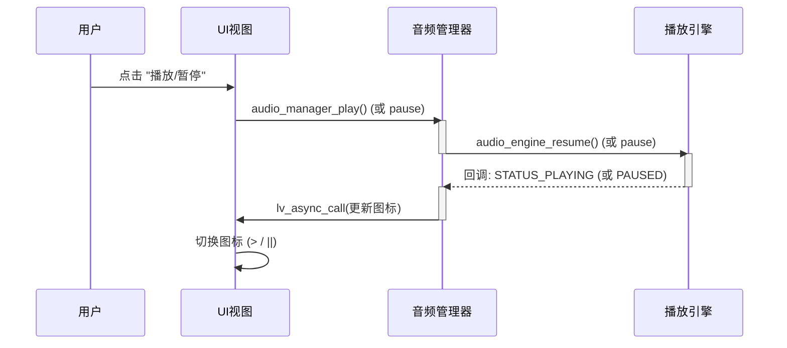
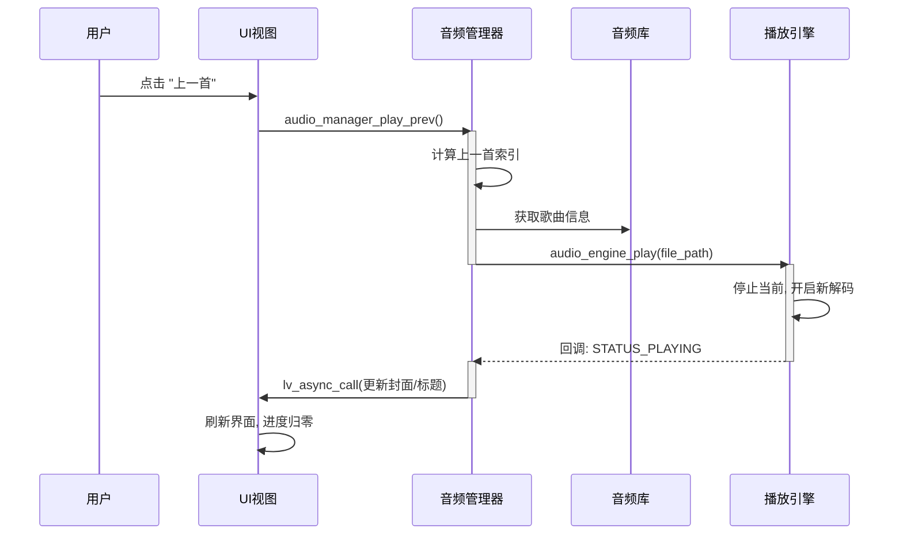
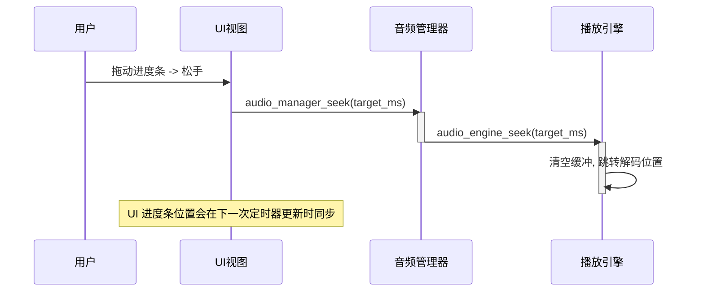
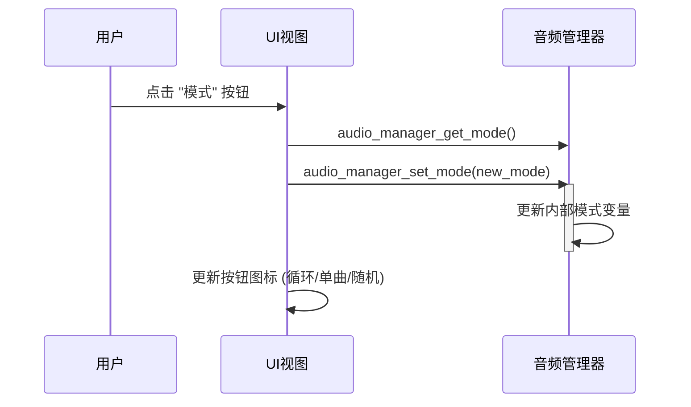
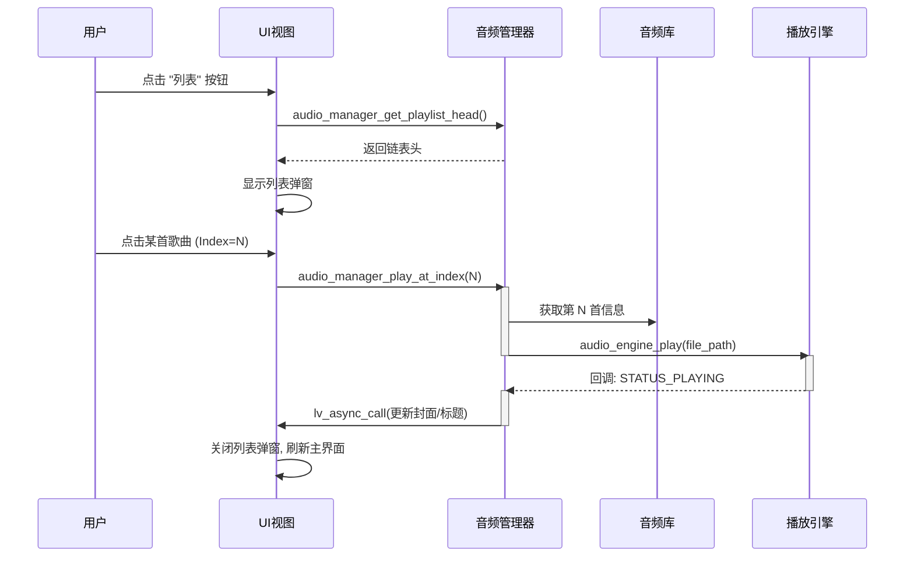
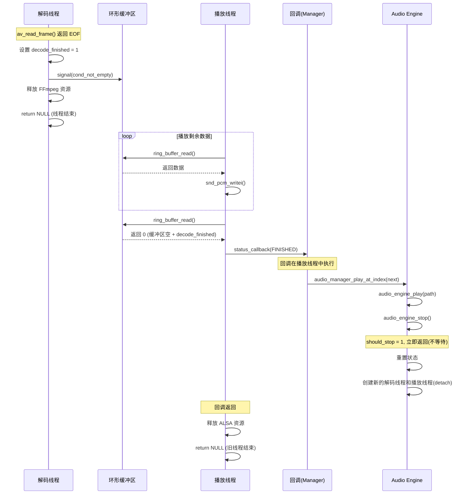

# 音乐播放器架构设计手册

## 版本记录

| 版本 | 变更内容 | 问题/反馈 | 解决方案 |
| :--- | :--- | :--- | :--- |
| **v1.0** | 初始草案 (MVC 架构) | N/A | 建立基础 MVC 分层架构。 |
| **v2.0** | 引入环形缓冲，细化中间层 | 1. 架构图渲染错误<br>2. 中间层职责不清<br>3. 引擎线程模型疑问<br>4. UI 更新机制疑问 | 1. 尝试修复 Mermaid 语法<br>2. 明确 Manager 为中间层，负责调度<br>3. 引入“解码+播放”双线程及环形缓冲区<br>4. 提出 `lv_timer` 轮询方案 |
| **v3.0** | 统一命名 (audio_), 修复 Mermaid, 优化接口 | 1. 架构图依然错误<br>2. 命名不统一<br>3. Seek 接口参数不合理<br>4. 歌词获取时机不明<br>5. UI 异步更新机制不明 | 1. 使用英文 ID 修复 Mermaid<br>2. 统一前缀 `audio_`，小写下划线命名<br>3. Seek 改为 `int64_t time_ms`<br>4. 歌词整合进 `MusicInfo`<br>5. 引入 `lv_async_call` 处理状态突变 |
| **v4.0** | ASCII 架构图, 完善 API | 1. 架构图依然渲染失败<br>2. 接口定义不完整<br>3. 链表结构冗余<br>4. UI 子视图未定义 | 1. 改用 ASCII 文本图<br>2. 补全 Manager, Library, Engine 所有核心 API<br>3. `MusicInfo` 改为单向链表，歌词独立结构体<br>4. 定义 Main 和 Playlist 子视图及布局 |
| **v5.0** | 交互时序图, UI 布局, 注释 | 1. 需要更详细的交互图<br>2. 需要 UI 布局细节<br>3. 数据结构缺注释<br>4. 明确默认视图 | 1. 新增 Mermaid 时序图 (Next Song)<br>2. 设计 1024x600 像素级布局<br>3. 添加详细注释<br>4. 明确默认进入 Main View |
| **v6.0** | 全场景交互图, 详细历史 | 1. 需要所有操作的交互图<br>2. 需要详细的版本历史记录 | 1. 新增 Play/Pause, Prev, Seek, Mode, Playlist 时序图<br>2. 完善版本记录表 |
| **v7.0** | 播放列表布局, 中文支持 | 1. 模块设计需更详细<br>2. 播放列表布局具体化<br>3. 中文显示支持 | 1. 增加模块内部逻辑描述<br>2. 设计居中弹窗式播放列表 (包含时长)<br>3. 集成 `common.c` 的 FreeType 字体 |
| **v8.0** | 完整对接流程, 扫描细节 | 1. 文档内容必须完整，不可省略<br>2. 详细介绍各模块上下层对接及流程<br>3. 详细说明扫描策略(目录/扩展名/封面) | 1. 恢复所有交互图和细节<br>2. 增加“对接与流程”章节<br>3. 明确支持 mp3/wav/flac 等，封面缓存至 `/tmp` |
| **v9.0** | 场景化流程详解 | 1. 对接流程不够详细<br>2. 需覆盖播放/暂停/切歌等具体场景 | 1. 在每个模块的“对接与流程”中，详细拆解 Play/Pause/Next/Seek 等场景的调用链和状态流转 |

---

## 1. 整体架构与交互

### 1.1 架构图 (ASCII)

```text
+-------------+      +-------------+      +-----------------+
|  用户输入   | ---> |   UI 视图   | <--> |  音频管理器     |
+-------------+      | (UI View)   |      | (Audio Manager) |
                     +-------------+      +--------+--------+
                            ^                      |
                            | 异步通知             | 控制/回调
                            |                      v
                     +------+------+      +--------+--------+
                     |  音频库     |      |   播放引擎      |
                     | (Audio Lib) |      | (Audio Engine)  |
                     +------+------+      +--------+--------+
                            |                      |
                     +------+------+      +--------+--------+
                     |  文件系统   |      |   ALSA 输出     |
                     +-------------+      +-----------------+
```

### 1.2 模块交互时序图

#### 1.2.1 播放/暂停 (Play/Pause)


#### 1.2.2 上一首 (Previous Song)


#### 1.2.3 进度跳转 (Seek)


#### 1.2.4 模式切换 (Mode Switch)


#### 1.2.5 播放列表选择 (Playlist Selection)


---

## 2. 详细模块设计

### 2.1 音频管理器 (Audio Manager) - 中间层

#### 2.1.1 设计理念
作为系统的**状态机**和**调度器**。它不处理具体的数据（不解码、不绘图），只处理逻辑。
*   **状态管理**: 维护 `current_music_info` (当前歌曲) 和 `play_mode` (播放模式)。
*   **自动流转**: 监听 Engine 的 `FINISHED` 事件。如果当前是 `LOOP_LIST`，自动计算 `next = current->next` 并播放；如果是 `SHUFFLE`，随机选取一首。

#### 2.1.2 对接与流程详解

**1. 播放/暂停流程 (Play/Pause)**
*   **场景**: 用户点击播放/暂停按钮。
*   **上层 (UI) 对接**: UI 调用 `audio_manager_play()`。
*   **内部逻辑**:
    *   检查当前状态 `current_status`。
    *   如果是 `PLAYING` -> 目标是暂停。
    *   如果是 `PAUSED` -> 目标是恢复。
    *   如果是 `STOPPED` -> 目标是从头播放当前歌曲（或第一首）。
*   **下层 (Engine) 对接**:
    *   暂停: 调用 `audio_engine_pause()`。
    *   恢复: 调用 `audio_engine_resume()`。
    *   播放: 调用 `audio_engine_play(current_file_path)`。
*   **状态反馈**: 等待 Engine 回调 `STATUS_PAUSED` 或 `STATUS_PLAYING`，然后通过 `lv_async_call` 通知 UI 更新图标。

**2. 切歌流程 (Next/Prev/Index)**
*   **场景**: 用户点击下一首/上一首，或在列表点击某首歌。
*   **上层 (UI) 对接**: UI 调用 `audio_manager_play_next()` 或 `play_at_index(i)`。
*   **内部逻辑**:
    *   根据当前 `play_mode` 计算目标歌曲索引。
        *   `LOOP_LIST`: `current->next`。
        *   `SHUFFLE`: `rand() % count`。
    *   更新 `current_music_info` 指针。
*   **下层 (Engine) 对接**: 调用 `audio_engine_play(new_file_path)`。
*   **状态反馈**: Engine 停止旧线程，启动新线程，回调 `STATUS_PLAYING`。Manager 通知 UI 更新封面、标题、歌手。

**3. 进度跳转流程 (Seek)**
*   **场景**: 用户拖动进度条。
*   **上层 (UI) 对接**: UI 调用 `audio_manager_seek(target_ms)`。
*   **下层 (Engine) 对接**: 直接透传调用 `audio_engine_seek(target_ms)`。
*   **UI 反馈**: 此时不立即更新 UI，等待下一次定时器轮询获取最新 `position`。

**4. 自动播放流程 (Auto Next)**
*   **场景**: 当前歌曲播放结束。
*   **下层 (Engine) 对接**: Engine 回调 `STATUS_FINISHED`。
*   **内部逻辑**:
    *   判断模式：
        *   `LOOP_SINGLE`: 再次播放当前歌曲。
        *   `LOOP_LIST`: 计算下一首。
*   **下层 (Engine) 对接**: 调用 `audio_engine_play(next_path)`。
*   **状态反馈**: 同“切歌流程”。

#### 2.1.3 接口定义
```c
// --- 初始化 ---
int audio_manager_init(void);

// --- 播放控制 ---
int audio_manager_play(void);                // 播放/暂停切换
int audio_manager_pause(void);               // 暂停
int audio_manager_stop(void);                // 停止
int audio_manager_play_next(void);           // 下一首
int audio_manager_play_prev(void);           // 上一首
int audio_manager_play_at_index(int index);  // 播放列表指定索引
int audio_manager_seek(int64_t time_ms);     // 跳转到指定时间(ms)
int audio_manager_set_mode(play_mode_t mode);// 设置模式

// --- 信息获取 ---
music_info_t* audio_manager_get_current_info(void); // 获取当前歌曲信息
int64_t audio_manager_get_position(void);           // 获取当前进度 (ms)
int64_t audio_manager_get_duration(void);           // 获取总时长 (ms)
player_status_t audio_manager_get_status(void);     // 获取播放状态

// --- 播放列表管理 ---
int audio_manager_scan_dir(const char *path);       // 扫描目录
int audio_manager_get_playlist_count(void);         // 获取歌曲总数
music_info_t* audio_manager_get_playlist_head(void);// 获取链表头
```

### 2.2 音频库 (Audio Library)

#### 2.2.1 设计理念
作为**数据持久层**。负责文件扫描、元数据解析和内存管理。

#### 2.2.2 对接与流程详解

**1. 目录扫描流程 (Scan)**
*   **场景**: APP 启动或用户手动刷新。
*   **上层 (Manager) 对接**: Manager 调用 `audio_library_scan_dir(path)`。
*   **内部逻辑**:
    *   `opendir(path)` 打开目录。
    *   `while(readdir)` 遍历文件。
    *   如果是子目录 -> 递归调用。
    *   如果是文件 -> 检查扩展名 (mp3/wav/...)。
*   **下层 (FFmpeg) 对接**:
    *   调用 `avformat_open_input` 打开文件。
    *   调用 `av_dict_get` 读取 metadata (title, artist, album)。
    *   查找视频流，提取封面数据，写入 `/tmp` 缓存文件。
*   **数据构建**: 创建 `music_info_t` 节点，插入链表尾部。
*   **返回**: 返回链表头指针给 Manager。

**2. 歌词加载流程 (Load Lyrics)**
*   **场景**: 扫描到音频文件时。
*   **内部逻辑**:
    *   构造同名 `.lrc` 路径 (如 `song.mp3` -> `song.lrc`)。
    *   尝试 `fopen` 打开 lrc 文件。
*   **解析逻辑**:
    *   按行读取。
    *   正则匹配或字符串解析 `[mm:ss.xx]`。
    *   转换为毫秒时间戳。
    *   构建 `lyric_info_t` 结构体并挂载到 `music_info_t`。

#### 2.2.3 扫描策略细节
1.  **递归扫描**: 
    *   输入: 根目录路径 (如 `/mnt/sdcard/music` 或 `./resources/audio`)。
    *   逻辑: 遇到子目录则递归调用。
2.  **扩展名支持**:
    *   白名单: `.mp3`, `.wav`, `.flac`, `.m4a`, `.aac`, `.ogg`。
    *   忽略大小写。
3.  **封面图获取与保存**:
    *   **提取**: 使用 FFmpeg 查找视频流 (`AVMEDIA_TYPE_VIDEO`)，通常是 MJPEG 格式的封面。
    *   **保存**: 将提取的二进制数据写入临时文件。
        *   路径: `/tmp/music_cover_<hash>.jpg` (使用文件名哈希避免冲突)。
        *   优化: 如果文件已存在且大小一致，跳过写入。
    *   **字段**: 将临时文件路径赋值给 `music_info_t->cover_path`。
4.  **歌词关联**:
    *   逻辑: 扫描到 `song.mp3` 时，检查同目录下是否存在 `song.lrc`。
    *   解析: 按行读取，解析 `[mm:ss.xx]` 格式，存入 `lyric_info_t`。

#### 2.2.4 数据结构
```c
typedef struct {
    int64_t time_ms;  // 时间戳 (毫秒)
    char *text;       // 歌词文本内容
} lyric_line_t;

// 歌词集合结构体
typedef struct {
    lyric_line_t *lines; // 歌词行数组
    int count;           // 歌词行数
} lyric_info_t;

// 音乐信息结构体 (单向链表节点)
typedef struct music_info {
    char *file_path;    // 文件绝对路径
    char *title;        // 歌曲标题 (ID3 Tag)
    char *artist;       // 歌手 (ID3 Tag)
    char *album;        // 专辑 (ID3 Tag)
    int64_t duration_ms;// 总时长 (毫秒)
    char *cover_path;   // 封面图片路径 (缓存的临时文件)
    
    lyric_info_t *lyrics; // 关联的歌词信息 (可为 NULL)
    
    struct music_info *next; // 指向下一首歌曲的指针
} music_info_t;
```

### 2.3 播放引擎 (Audio Engine)

#### 2.3.1 设计理念
作为**执行单元**。采用**生产者-消费者**模型。
*   **解码线程 (Producer)**: 负责 CPU 密集型任务（文件读取、解码、重采样）。将 PCM 数据填入 Ring Buffer。
*   **播放线程 (Consumer)**: 负责 IO 密集型任务（ALSA 写入）。从 Ring Buffer 取数据。
*   **同步**: 使用信号量控制缓冲区的满/空状态，确保播放流畅无卡顿。

#### 2.3.2 对接与流程详解

**1. 开始播放流程 (Play)**
*   **上层 (Manager) 对接**: Manager 调用 `audio_engine_play(path)`。
*   **内部逻辑**:
    *   设置状态 `STATUS_PLAYING`。
    *   如果已有线程在运行，先发送停止信号并 `pthread_join` 等待结束。
    *   初始化 Ring Buffer。
    *   创建 **解码线程** 和 **播放线程**。
*   **下层 (FFmpeg/ALSA) 对接**:
    *   解码线程: `av_read_frame` -> 解码 -> 重采样 -> 写入 Ring Buffer。
    *   播放线程: 读取 Ring Buffer -> `snd_pcm_writei` 写入 ALSA。

**2. 暂停/恢复流程 (Pause/Resume)**
*   **上层 (Manager) 对接**: 调用 `pause()` 或 `resume()`。
*   **内部逻辑**:
    *   `pause`: 设置全局标志位 `is_paused = 1`。播放线程检测到此标志，停止从 Ring Buffer 读取，进入 `usleep` 休眠，并调用 `snd_pcm_pause` (如果硬件支持) 或写入静音数据。
    *   `resume`: 设置 `is_paused = 0`。播放线程恢复读取和写入。

**3. 跳转流程 (Seek)**
*   **上层 (Manager) 对接**: 调用 `seek(ms)`。
*   **内部逻辑**:
    *   设置标志位 `is_seeking = 1`。
    *   **解码线程**: 检测到 seek 请求 -> 调用 `av_seek_frame` 跳转到目标时间戳 -> 清空 Ring Buffer -> 恢复解码。
    *   **播放线程**: 检测到 seek -> 丢弃当前缓冲区数据 -> 等待新数据。

#### 2.3.3 接口定义
```c
int audio_engine_init(void);

// 核心控制
int audio_engine_play(const char *file_path); // 启动播放线程
void audio_engine_pause(void);                // 暂停播放 (保留资源)
void audio_engine_resume(void);               // 恢复播放
void audio_engine_stop(void);                 // 停止播放 (释放解码资源)
void audio_engine_seek(int64_t time_ms);      // 触发 Seek 操作

// 状态回调注册
void audio_engine_set_callback(engine_status_cb_t cb, void *user_data);
```

### 2.4 UI 视图 (UI View)

#### 2.4.1 设计理念
负责展示和交互。**不包含业务逻辑**。

#### 2.4.2 对接与流程详解

**1. 用户点击播放按钮**
*   **UI 动作**: 捕获 `LV_EVENT_CLICKED`。
*   **向上对接 (Manager)**: 调用 `audio_manager_play()`。
*   **UI 响应**: 此时**不**立即改变图标。等待 Manager 的异步回调。

**2. 收到状态更新通知**
*   **场景**: Manager 通过 `lv_async_call` 执行 `ui_update_callback`。
*   **内部逻辑**:
    *   读取 `audio_manager_get_status()`。
    *   如果是 `PLAYING`: 设置按钮图标为 "||" (暂停)。
    *   如果是 `PAUSED/STOPPED`: 设置按钮图标为 ">" (播放)。
    *   读取 `audio_manager_get_current_info()`: 更新封面图片、标题 Label、歌手 Label。

**3. 定时器更新 (每 500ms)**
*   **场景**: `lv_timer` 回调触发。
*   **向下对接 (Manager)**:
    *   调用 `audio_manager_get_position()` 获取当前时间。
    *   调用 `audio_manager_get_duration()` 获取总时间。
*   **UI 响应**:
    *   更新进度条 `lv_bar_set_value`。
    *   更新时间文本 `01:23 / 04:56`。
    *   **歌词滚动**: 遍历 `current_info->lyrics`，找到时间戳匹配的行，调整 `lv_list` 或 `lv_label` 的位置以高亮显示当前行。

#### 2.4.3 字体支持 (中文显示)
为了支持中文歌曲名和歌词显示，必须使用 FreeType 字体引擎。
*   **引用**: `#include "common.h"`
*   **API**: `font_manager_get_freetype_font(size)`
*   **应用**:
    *   歌名/歌手: 使用 24pt 或 32pt 字体。
    *   歌词: 使用 18pt 或 24pt 字体。
    *   列表项: 使用 20pt 字体。

#### 2.4.4 布局设计 (1024 x 600)

**1. 主播放界面 (Main View)**
采用左右分栏布局：

*   **左侧 (400px)**: 视觉中心
    *   **封面图**: 300x300px, 居中显示 (y=50)。
    *   **歌曲信息**: 位于封面下方。
        *   Title: 24pt 字体, 居中。
        *   Artist: 18pt 字体, 居中, 灰色。

*   **右侧 (624px)**: 歌词与控制
    *   **歌词区**: 顶部, 宽 500px, 高 400px。显示 5-7 行歌词，当前行高亮放大。
    *   **控制区**: 底部 (y=450)。
        *   **进度条**: 宽 500px, 位于按钮上方。
        *   **时间**: 进度条两侧显示 `00:00 / 03:45`。
        *   **按钮组**: [模式] [上一首] [播放/暂停] [下一首] [列表]。
            *   播放按钮: 64x64px。
            *   其他按钮: 48x48px。

**2. 播放列表视图 (Playlist View) - 弹窗式设计**
*   **容器**: 一个居中的 `lv_obj` (Panel)，带有阴影和圆角。
    *   **尺寸**: 宽 800px, 高 500px (屏幕居中，四周留白)。
    *   **背景**: 半透明黑色或深灰色 (Opacity 90%)。
*   **内容**: `lv_table` 或 自定义 `lv_list`。
    *   **列定义**:
        1.  **序号**: 宽 50px (例如 "1")
        2.  **歌曲标题**: 宽 400px (例如 "七里香") - *使用 FreeType 字体*
        3.  **歌手**: 宽 200px (例如 "周杰伦") - *使用 FreeType 字体*
        4.  **时长**: 宽 100px (例如 "04:59")
*   **交互**:
    *   点击某行: 播放该曲并关闭弹窗。
    *   点击弹窗外区域 (遮罩层): 关闭弹窗。

#### 2.4.5 UI 更新逻辑
*   **状态突变**: `audio_manager` -> `lv_async_call` -> 更新播放按钮/封面/歌名。
*   **进度更新**: `lv_timer` (500ms) -> `audio_manager_get_position` -> 更新进度条/时间/歌词滚动。

---

## 3. 代码实现细节

### 3.1 Audio Library 实现 (已完成)

#### 3.1.1 文件结构
*   **头文件**: `src/include/app/audio_library.h`
*   **实现文件**: `src/app/core/audio_library.c`

#### 3.1.2 核心实现逻辑

**1. 递归扫描算法 (`audio_library_scan_dir`)**
```
主函数:
1. opendir() 打开目录
2. 初始化链表 head = NULL, tail = NULL
3. while (readdir) 遍历:
   a. 跳过 "." 和 ".."
   b. 构造完整路径
   c. stat() 获取文件状态
   d. 分支处理:
      - 如果是目录: 递归调用 scan_dir，合并返回的子链表
      - 如果是文件: 调用 is_audio_file 检查扩展名
         ✓ 如果匹配: 创建 music_info_t 节点
           - 调用 extract_metadata 提取元数据
           - 调用 parse_lrc_file 加载歌词
           - 插入链表尾部
4. 返回 head
```

**2. 元数据提取 (`extract_metadata`)**
```
使用 libavformat API:
1. av_log_set_level(AV_LOG_QUIET) - 抑制日志
2. avformat_open_input() - 打开文件
3. avformat_find_stream_info() - 获取流信息
   -> 提取 duration (微秒 -> 毫秒)
4. av_dict_get() - 读取元数据标签:
   - "title" -> info->title
   - "artist" -> info->artist  
   - "album" -> info->album
5. avformat_close_input() - 关闭资源
```

**3. 歌词解析 (`parse_lrc_file`)**
```
两遍扫描策略:
第一遍: 统计有效歌词行数 (包含 "[mm:ss.xx]" 格式)
第二遍:
1. rewind() 回到文件开头
2. 对每行使用 sscanf 解析:
   - 格式1: "[%d:%d.%d]%s" (毫秒精度)
   - 格式2: "[%d:%d]%s" (秒精度)
3. 转换为毫秒时间戳: min*60000 + sec*1000 + ms*10
4. 存储到 lyric_line_t 数组
```

#### 3.1.3 实现要点
*   使用 TAB 缩进 (宽度 8)
*   采用 `calloc` 初始化结构体，避免未初始化字段
*   使用 `strcasecmp` 实现扩展名不区分大小写
*   歌词路径构造：替换音频文件扩展名为 `.lrc`
*   内存管理：提供 `free_list` 和 `free_lyrics` 函数释放资源

### 3.2 Audio Engine 实现 (已完成)

#### 3.2.1 文件结构
*   **头文件**: `src/include/app/audio_engine.h`
*   **实现文件**: `src/app/core/audio_engine.c` (~450行)

#### 3.2.2 核心实现逻辑

**1. 环形缓冲区设计**
```
结构体 ring_buffer_t:
- data[512KB]: 固定大小缓冲区
- read_pos, write_pos: 读写指针
- available: 当前可用数据量
- mutex + 2个条件变量 (not_empty, not_full)

写入逻辑:
1. 加锁
2. 如果缓冲区满 -> 等待 cond_not_full
3. 计算环形写入位置 (可能需要分两段复制)
4. 更新 write_pos 和 available
5. 唤醒 cond_not_empty
6. 解锁

读取逻辑 (对称):
1. 加锁
2. 如果缓冲区空 -> 等待 cond_not_empty
3. 环形读取
4. 更新 read_pos 和 available
5. 唤醒 cond_not_full
6. 解锁
```

**2. 解码线程 (`decode_thread_func`)**
```
主循环:
1. 检查 seek_request -> 调用 av_seek_frame + 清空缓冲区
2. 检查 is_paused -> 休眠等待
3. av_read_frame 读取音频包
4. avcodec_send_packet + avcodec_receive_frame 解码
5. swr_convert 重采样 (目标: 44.1kHz/Stereo/S16LE)
6. ring_buffer_write 写入PCM数据
7. 更新 position_ms (基于 frame->pts)
8. 循环直到文件结束或 should_stop

播放结束处理:
- 设置状态为 PLAYER_STATUS_FINISHED
- 调用 status_callback 通知 Manager
```

**3. 播放线程 (`playback_thread_func`)**
```
主循环:
1. 检查 is_paused -> 调用 snd_pcm_pause
2. ring_buffer_read 读取PCM数据
3. snd_pcm_writei 写入ALSA (阻塞写入, 天然流控)
4. 错误处理: snd_pcm_recover
5. 循环直到缓冲区空且解码结束
```

**4. 线程同步机制**
*   **启动**: `audio_engine_play` 创建双线程
*   **暂停**: 设置 `is_paused` 标志，两线程检测并休眠
*   **恢复**: 清除 `is_paused`，两线程继续运行
*   **停止**: 设置 `should_stop`，唤醒所有条件变量，`pthread_join` 等待线程结束
*   **Seek**: 设置 `seek_request`，解码线程处理后清空缓冲区

#### 3.2.3 实现要点
*   采用单一全局 `audio_engine_t g_engine` 实例（单例模式)
*   所有状态访问通过 `status_mutex` 保护
*   ALSA 阻塞写入机制提供天然的流量控制
*   使用 volatile 修饰符标记跨线程共享的控制标志
*   正确的资源清理顺序：先停止线程，再释放 FFmpeg/ALSA 资源

### 3.3 Audio Manager 实现 (已完成)

#### 3.3.1 文件结构
*   **头文件**: `src/include/app/audio_manager.h`
*   **实现文件**: `src/app/core/audio_manager.c` (~260行)

#### 3.3.2 核心实现逻辑

**1. 状态管理**
```
全局结构体 audio_manager_t:
- playlist_head: 播放列表链表头
- playlist_count: 歌曲总数
- current_music: 当前播放的歌曲指针
- current_index: 当前歌曲索引
- play_mode: 播放模式 (列表循环/单曲循环/随机)

单例模式: static audio_manager_t g_manager
```

**2. 播放模式实现 (`calculate_next_index`)**
```
PLAY_MODE_LOOP_LIST (列表循环):
- next = (current + 1) % count

PLAY_MODE_LOOP_SINGLE (单曲循环):
- next = current

PLAY_MODE_SHUFFLE (随机播放):
- next = rand() % count
```

**3. 自动播放流程 (`engine_status_callback`)**
```
Engine 回调 -> Manager:
if (status == PLAYER_STATUS_FINISHED):
   1. 计算下一首索引 (根据播放模式)
   2. 调用 audio_manager_play_at_index(next)
   3. Engine 开始播放新歌曲
```

**4. 播放/暂停切换 (`audio_manager_play`)**
```
获取当前状态:
- STOPPED: 从头播放或播放第一首
- PLAYING: 调用 audio_engine_pause()
- PAUSED: 调用 audio_engine_resume()
```

#### 3.3.3 实现要点
*   作为 Library 和 Engine 的桥梁，不直接处理文件或音频数据
*   使用 `time.h` 的 `srand(time(NULL))` 初始化随机数种子
*   所有播放控制透传给 Engine，Manager 只负责逻辑判断
*   在 `scan_dir` 时正确释放旧列表，避免内存泄漏
*   使用 TAB 缩进（宽度 8），严格遵守编码规范

---

## 4. 实现总结

### 4.1 已完成模块
1. ✅ **Audio Library** - 数据层（278行）
2. ✅ **Audio Engine** - 引擎层（512行）
3. ✅ **Audio Manager** - 中间层（260行）

### 4.2 待实现模块
4. ⏳ **Audio View** - UI层（需集成 LVGL + FreeType）

### 4.3 总体代码量
核心模块总计: **~1050行** (不含头文件)

### 4.4 技术要点回顾
*   **线程模型**: 解码线程 + 播放线程 + 主线程（UI）
*   **同步机制**: 互斥锁 + 条件变量 + 环形缓冲区
*   **内存管理**: 严格的资源释放顺序，避免泄漏
*   **编码规范**: TAB 缩进（宽度 8），统一命名前缀 `audio_`

### 4.5 Audio View 实现 (已完成)

#### 4.5.1 文件结构
*   **头文件**: `src/include/app/audio_view.h`
*   **实现文件**: `src/app/ui/audio_view.c` (~460行)

#### 4.5.2 核心实现逻辑

**1. UI 布局实现 (1024x600)**
```
左侧 (0-400px):
- 封面图: 300x300px @ (50, 50)
- 歌名 Label: 32pt FreeType @ (50, 370)
- 歌手 Label: 18pt FreeType @ (50, 415)

右侧 (400-1024px):
- 歌词 Label: 500x400px @ (450, 30)
- 进度条: 500x10px @ (450, 460)
- 时间标签: 当前/总时长 @ (400, 460) & (960, 460)
- 控制按钮: 5个按钮水平排列 @ y=510
  * 模式 (50x50)
  * 上一首 (50x50)
  * 播放/暂停 (60x60, 大一号)
  * 下一首 (50x50)
  * 播放列表 (80x40, 中文)
```

**2. 播放列表弹窗**
```
结构:
- popup容器: 全屏遮罩 (半透明黑色)
- list_cont: 800x500px 居中弹窗
- lv_table: 4列表格
  列1: 序号 (50px)
  列2: 标题 (400px, FreeType中文)
  列3: 歌手 (200px, FreeType中文)
  列4: 时长 (100px)

显示/隐藏:
- 默认: LV_OPA_TRANSP (透明, 隐藏)
- 点击"播放列表": LV_OPA_COVER (显示)
- 点击列表项或遮罩: LV_OPA_TRANSP (隐藏)
```

**3. 定时器更新机制 (`update_timer_cb`)**
```
每 500ms 执行:
1. 检查播放状态
2. if (PLAYING):
   - update_progress(): 更新进度条和时间
   - update_lyrics(): 根据当前时间查找并更新歌词
3. update_play_button(): 同步播放按钮图标
```

**4. 事件响应流程**
```
用户操作          -> UI回调                    -> Manager API
点击播放/暂停     -> play_btn_event_cb()      -> audio_manager_play()
点击上一首        -> prev_btn_event_cb()      -> audio_manager_play_prev()
点击下一首        -> next_btn_event_cb()      -> audio_manager_play_next()
点击模式按钮      -> mode_btn_event_cb()      -> audio_manager_set_mode()
点击播放列表      -> playlist_btn_event_cb()  -> 显示弹窗
点击列表项        -> playlist_item_event_cb() -> audio_manager_play_at_index()
```

#### 4.5.3 实现要点
*   使用 `font_manager_get_freetype_font()` 加载中文字体 (18/24/32pt)
*   定时器主动轮询 (500ms) + 被动状态通知结合
*   播放列表采用 `lv_table` 控件，支持点击选择
*   所有文本 Label 使用 FreeType 字体，完美支持中文显示
*   使用 TAB 缩进（宽度 8），严格遵守编码规范

---

## 5. 项目总结

### 5.1 全部已实现模块

| 模块 | 文件 | 代码行数 | 功能描述 |
|:---|:---|:---:|:---|
| **Audio Library** | `audio_library.h/c` | 320 | 目录扫描、元数据提取、歌词解析 |
| **Audio Engine** | `audio_engine.h/c` | 548 | 环形缓冲区、解码/播放双线程、FFmpeg+ALSA |
| **Audio Manager** | `audio_manager.h/c` | 265 | 状态机、播放模式、自动切歌 |
| **Audio View** | `audio_view.h/c` | 473 | LVGL UI、FreeType中文、定时器更新 |
| **总计** | - | **1606行** | 完整的音乐播放器 |

### 5.2 核心技术栈

*   **音频解码**: FFmpeg (libavformat, libavcodec, libswresample)
*   **音频输出**: ALSA (Advanced Linux Sound Architecture)
*   **UI 框架**: LVGL 8.x
*   **中文字体**: FreeType 引擎
*   **线程同步**: pthread (mutex + cond)
*   **数据结构**: 单向链表 (播放列表)

### 5.3 架构特点

1. **清晰的分层设计**
   - 数据层 (Library) ← 中间层 (Manager) ← 表现层 (View)
   - 引擎层 (Engine) ← 中间层 (Manager)

2. **高效的多线程模型**
   - 解码线程：CPU 密集型任务
   - 播放线程：IO 密集型任务
   - UI 线程：用户交互（LVGL 主线程）

3. **完善的错误处理**
   - 资源释放顺序正确
   - 线程安全访问
   - 状态机流转清晰

4. **良好的编码规范**
   - TAB 缩进（宽度 8）
   - 统一命名前缀 `audio_`
   - 详细的注释和文档

### 5.4 待集成和测试

1. **main.c 集成**
   - 注册 `audio_view` 到 view_manager
   - 处理视图切换

2. **Makefile 更新**
   - 添加新的源文件到编译列表
   - 确保链接顺序正确

3. **功能测试**
   - 目录扫描
   - 播放控制
   - 模式切换
   - 歌词同步

4. **性能优化**
   - 缓冲区大小调整
   - 定时器周期优化
   - 内存占用分析


## 6. 功能验证

### 6.1 UI 界面验证

*   播放/暂停
*   上一首/下一首
*   播放模式切换
*   播放列表

---

## 7. 问题追踪与修复

本章记录开发过程中遇到的问题、分析及修复方案。

---

### 7.1 播放结束时应用卡死 (v10.0)

> **状态**: 🔴 待修复  
> **日期**: 2025-12-06  
> **严重程度**: 高

#### 7.1.1 问题现象

**现象**: 当歌曲即将播放完毕时，应用界面卡死，进度条停在接近 100% 的位置且无响应。

#### 7.1.2 问题根源


##### 7.1.2.1 原有设计缺陷

原有设计中，**解码线程**在读取完所有音频帧后，立即设置状态为 `PLAYER_STATUS_FINISHED` 并触发回调。

```text
问题调用链:

decode_thread_func()
  ↓ (av_read_frame 返回 EOF)
  ↓ 设置 status = FINISHED
  ↓ 调用 status_callback(FINISHED)
       ↓
  engine_status_callback() [audio_manager.c]
       ↓
  audio_manager_play_at_index(next)
       ↓
  audio_engine_play(path)
       ↓
  audio_engine_stop()
       ↓
  pthread_join(decode_thread)  ← 死锁！解码线程等待自己结束
```

##### 7.1.2.2 两个核心问题

| 问题                 | 描述                                                |
| :----------------- | :------------------------------------------------ |
| **问题 1: 状态上报时机错误** | 解码完成 ≠ 播放结束。解码线程读完文件时，环形缓冲区中可能还有数据未播放完毕。          |
| **问题 2: 回调触发死锁**   | 在线程上下文中触发回调，回调又调用会阻塞该线程的函数 (`pthread_join`)，导致死锁。 |

#### 7.1.3 修复方案

##### 7.1.3.1 设计原则

1. **播放结束状态由播放线程上报** — 只有当环形缓冲区播放完毕，才是真正的播放结束
2. **解码线程设置 `decode_finished` 标志** — 通知播放线程文件已读取完毕
3. **`audio_engine_stop()` 不等待线程** — 只设置 `should_stop` 标志，不调用 `pthread_join`
4. **线程使用 `pthread_detach`** — 线程结束后自动回收资源
5. **每个线程管理自己的资源** — 播放线程创建/释放 ALSA，解码线程自己释放 FFmpeg 资源
6. **回调可直接调用 `play()`** — 因为 `stop()` 不阻塞，无死锁风险

##### 7.1.3.2 修复后的时序图



#### 7.1.4 具体代码修改

##### Audio Engine 修改

**1. 添加 `decode_finished` 标志:**

```c
// audio_engine.c - 结构体定义
typedef struct {
    // ... 其他字段 ...
    volatile int decode_finished;  // 新增：解码完成标志
} audio_engine_t;
```

**2. 解码线程 - 设置标志并释放资源:**

```c
// decode_thread_func()
if (av_read_frame(fmt_ctx, packet) < 0) {
    // 解码完成，设置标志并唤醒播放线程
    g_engine.decode_finished = 1;
    pthread_cond_signal(&g_engine.ring_buffer.cond_not_empty);
    break;
}

// cleanup 部分：释放 FFmpeg 资源
// （已有代码，保持不变）
```

**3. 环形缓冲区读取 - 增加完成检测:**

```c
// ring_buffer_read()
while (rb->available < size && !g_engine.should_stop && !g_engine.decode_finished) {
    pthread_cond_wait(&rb->cond_not_empty, &rb->mutex);
}

if (rb->available == 0 && (g_engine.decode_finished || g_engine.should_stop)) {
    pthread_mutex_unlock(&rb->mutex);
    return 0;
}
```

**4. 播放线程 - ALSA 资源独立管理，上报结束状态:**

```c
static void *playback_thread_func(void *arg) {
    snd_pcm_t *alsa_handle = NULL;
    
    // 线程内创建 ALSA 句柄
    if (alsa_init(&alsa_handle) < 0) {
        return NULL;
    }
    
    while (!g_engine.should_stop) {
        int bytes_read = ring_buffer_read(...);
        if (bytes_read == 0) {
            break;
        }
        snd_pcm_writei(alsa_handle, buffer, ...);
        // ...
    }
    
    // 歌曲自然播放完成，调用回调
    if (!g_engine.should_stop && g_engine.decode_finished) {
        g_engine.status = PLAYER_STATUS_FINISHED;
        if (g_engine.status_callback) {
            g_engine.status_callback(PLAYER_STATUS_FINISHED, g_engine.callback_user_data);
        }
    }
    
    // 释放 ALSA 资源
    snd_pcm_drain(alsa_handle);
    snd_pcm_close(alsa_handle);
    
    return NULL;
}
```

**5. audio_engine_stop() - 不等待线程:**

```c
void audio_engine_stop(void) {
    g_engine.should_stop = 1;
    
    // 唤醒等待的线程
    pthread_cond_broadcast(&g_engine.ring_buffer.cond_not_empty);
    pthread_cond_broadcast(&g_engine.ring_buffer.cond_not_full);
    pthread_cond_broadcast(&g_engine.pause_cond);
    
    // 不等待线程，直接返回
    // 线程会检测 should_stop 并自行退出
    g_engine.thread_running = 0;
    g_engine.status = PLAYER_STATUS_STOPPED;
}
```

**6. audio_engine_play() - 线程 detach:**

```c
int audio_engine_play(const char *file_path) {
    audio_engine_stop();  // 不阻塞
    
    // 重置状态
    g_engine.should_stop = 0;
    g_engine.decode_finished = 0;
    // ... 其他重置 ...
    
    // 创建线程并 detach
    pthread_create(&g_engine.decode_thread, NULL, decode_thread_func, NULL);
    pthread_detach(g_engine.decode_thread);
    
    pthread_create(&g_engine.playback_thread, NULL, playback_thread_func, NULL);
    pthread_detach(g_engine.playback_thread);
    
    g_engine.thread_running = 1;
    g_engine.status = PLAYER_STATUS_PLAYING;
    
    return 0;
}
```

##### Audio Manager 修改

**回调函数 - 直接调用切歌:**

```c
static void engine_status_callback(player_status_t status, void *user_data)
{
    if (status == PLAYER_STATUS_FINISHED) {
        // 直接切歌，因为 stop() 不会阻塞
        int next_index = calculate_next_index();
        if (next_index >= 0) {
            audio_manager_play_at_index(next_index);
        }
    }
}
```

##### Audio View 修改

**无需修改** — UI 层不再参与播放流程控制。

#### 7.1.5 关键设计对比

| 方面 | 原设计 | 新设计 |
|:---|:---|:---|
| **结束状态上报者** | 解码线程 | 播放线程 |
| **判断播放结束的条件** | 文件读取完毕 | 缓冲区播放完毕 + 文件读取完毕 |
| **`stop()` 行为** | `pthread_join` 阻塞等待 | 只设置标志，立即返回 |
| **线程模式** | 普通线程 | `pthread_detach` 自动回收 |
| **ALSA 资源管理** | 全局共享 | 每个播放线程独立管理 |
| **回调操作** | 触发死锁 | 直接调用 `play()`，无死锁 |

#### 7.1.6 测试验证

1. **编译运行**，进入音乐播放器界面
2. **播放短音频**（建议 5-10 秒）或等待歌曲自然结束
3. **验证清单**:
   - [ ] 进度条能跑满到 100%
   - [ ] 应用不卡死，UI 持续响应
   - [ ] 自动切换到下一首歌曲
   - [ ] 封面、歌名、进度正确更新


### 7.2 Seek 功能实现详解

> **状态**: ✅ 已修复  
> **日期**: 2025-12-07  

#### 7.2.1 问题背景

在实现进度条拖动 seek 功能时，遇到了以下问题：

1. **时间戳单位错误**：`av_seek_frame` 一直跳转到开头
2. **线程竞态条件**：播放线程可能错过 seek 事件

#### 7.2.2 问题一：FFmpeg 时间戳单位

**错误代码：**
```c
int64_t seek_ts = g_engine.seek_target_ms * 1000;  // 错误！假设单位是微秒
av_seek_frame(fmt_ctx, audio_stream_index, seek_ts, AVSEEK_FLAG_BACKWARD);
```

**问题原因：**
- `av_seek_frame` 的时间戳单位取决于传入的 `stream_index`
- 当 `stream_index >= 0` 时，时间戳单位是该流的 `time_base`
- 音频流的 `time_base` 通常是 `1/44100` 或 `1/48000`（采样率）
- 直接将毫秒乘以 1000 得到的值与实际需要的时间戳相差甩远

**正确代码：**
```c
// 将毫秒转换为流的 time_base 单位
AVRational time_base = fmt_ctx->streams[audio_stream_index]->time_base;
int64_t seek_ts = av_rescale_q(g_engine.seek_target_ms, (AVRational){1, 1000}, time_base);
av_seek_frame(fmt_ctx, audio_stream_index, seek_ts, AVSEEK_FLAG_BACKWARD);
```

**`av_rescale_q` 函数说明：**
- 将一个时间值从一个时间基准转换为另一个时间基准
- 参数：`(value, src_time_base, dst_time_base)`
- `(AVRational){1, 1000}` 表示毫秒（1/1000 秒）

#### 7.2.3 问题二：线程竞态条件

**问题场景：**
```
时间线     解码线程                           播放线程
───────────────────────────────────────────────────────────────────
T1      设置 seek_in_progress=1              正在 snd_pcm_writei() 阻塞...
T2      av_seek_frame()                      ...阻塞...
T3      ring_buffer_clear()                  ...阻塞...
T4      设置 seek_in_progress=0              ...阻塞...
T5      继续解码                             writei() 返回
T6                                           检查 seek_in_progress=0
T7                                           ❌ 错过了 seek！ALSA 缓冲区有旧数据
```

**解决方案：使用 Seek 序列号**

```c
// audio_engine_t 结构体
volatile int seek_sequence;  // seek 序列号 (每次 seek 递增)

// 解码线程 - seek 完成时递增
g_engine.seek_sequence++;

// 播放线程 - 对比序列号
static int last_seek_seq = 0;
if (g_engine.seek_sequence != last_seek_seq) {
    last_seek_seq = g_engine.seek_sequence;
    snd_pcm_drop(alsa_handle);    // 清空 ALSA 缓冲区
    snd_pcm_prepare(alsa_handle);
    continue;  // 重新读取新数据
}
```

**优势：**
- 序列号只增不减，播放线程永远不会错过 seek 事件
- 不依赖时序，无论解码线程多快完成 seek 都能检测到
- 代码简洁，无需等待或忙循环

#### 7.2.4 完整 Seek 调用链

```
UI 层                    Manager 层                 Engine 层
─────────────────────────────────────────────────────────────────
用户拖动滑动条
    │
    ▼
progress_slider_event_cb()
    │ percent (0-100)
    ▼
audio_manager_seek_percent()
    │ 计算 time_ms = duration * percent / 100
    ▼
audio_engine_seek()
    │ 设置 seek_request=1, seek_target_ms
    ▼
┌─────────────────────────┬─────────────────────────┐
│     解码线程            │     播放线程            │
├─────────────────────────┼─────────────────────────┤
│ 检测 seek_request=1     │ 检测 seek_sequence 变化 │
│ av_rescale_q 转换时间戳 │ snd_pcm_drop 清空缓冲   │
│ av_seek_frame 跳转      │ snd_pcm_prepare 重置    │
│ ring_buffer_clear       │ continue 读取新数据     │
│ seek_sequence++         │                         │
│ seek_request=0          │                         │
└─────────────────────────┴─────────────────────────┘
```

---
### 7.3 切歌卡顿问题修复

> **状态**: ✅ 已修复  
> **日期**: 2025-12-07  

#### 7.3.1 问题现象

点击"下一首"按钮时：
1. 当前播放的音乐没有立即停止，变得卡顿
2. 新的音乐逐渐出来，也是卡顿的
3. 日志显示：`ALSA open error: Device or resource busy`

#### 7.3.2 线程状态分析

**切歌时的线程状态图：**

```
┌─────────────────────────────────────────────────────────────────────┐
│                          用户点击"下一首"                            │
└─────────────────────────────────────────────────────────────────────┘
                                    │
                                    ▼
┌─────────────────────────────────────────────────────────────────────┐
│                     audio_engine_stop() 被调用                       │
│                     设置 should_stop = 1                             │
│                     pthread_cond_broadcast() 唤醒线程                │
└─────────────────────────────────────────────────────────────────────┘
                                    │
        ┌───────────────────────────┴───────────────────────────┐
        ▼                                                       ▼
┌───────────────────────────────┐       ┌───────────────────────────────┐
│         解码线程               │       │         播放线程               │
├───────────────────────────────┤       ├───────────────────────────────┤
│ 可能阻塞位置：                 │       │ 可能阻塞位置：                 │
│ 1. av_read_frame() ✅ 非阻塞   │       │ 1. snd_pcm_writei() ⚠️ 可能    │
│ 2. ring_buffer_write() ❌ 等待 │       │ 2. ring_buffer_read() ❌ 等待  │
│    cond_not_full               │       │    cond_not_empty              │
│                                │       │ 3. pause_cond ✅ 会被唤醒      │
└───────────────────────────────┘       └───────────────────────────────┘
```

**问题分析：**

即使 `pthread_cond_broadcast()` 唤醒了等待的线程，线程从 `wait` 返回后会**重新检查 while 条件**：

```c
// 原来的错误代码
while (rb->available < size) {  // ❌ 没有检查 should_stop
    pthread_cond_wait(&rb->cond_not_empty, &rb->mutex);
}
// 被唤醒后，如果 available < size 仍然成立，会继续等待！
```

**导致的后果：**

1. 解码线程可能卡在 `ring_buffer_write()` 等待空间
2. 播放线程可能卡在 `ring_buffer_read()` 等待数据
3. 主线程立即创建新线程，但旧线程还没退出
4. 新播放线程打开 ALSA 失败（设备被旧线程占用）
5. 多个线程同时访问 ring_buffer，导致音频数据混乱 → 卡顿

#### 7.3.3 问题根因详解

**问题一：ALSA 资源竞争**

```
时间线    主线程                    旧播放线程              新播放线程
─────────────────────────────────────────────────────────────────────────
T1      audio_engine_stop()       正在播放...            
T2      should_stop = 1          
T3      broadcast()              收到唤醒，但卡在 read()
T4      audio_engine_play()                              
T5      创建新播放线程                                    尝试 alsa_init()
T6                               还没执行到 close()       ❌ ALSA busy!
```

**问题二：条件变量逻辑缺陷**

```c
// ring_buffer_write - 解码线程
while ((rb->available + size) > RING_BUFFER_SIZE) {  // 只检查空间
    pthread_cond_wait(&rb->cond_not_full, &rb->mutex);
    // 被唤醒后，如果缓冲区还是满的，继续等待
    // 播放线程如果也卡住了，就形成死锁
}

// ring_buffer_read - 播放线程
while (rb->available < size) {  // 只检查数据
    pthread_cond_wait(&rb->cond_not_empty, &rb->mutex);
    // 被唤醒后，如果缓冲区还是空的，继续等待
    // 解码线程如果也卡住了，就形成死锁
}
```

**问题三：静态变量生命周期**

```c
static int last_seek_seq = 0;  // ❌ 进程级共享

// 新线程创建后，last_seek_seq 保持旧值
// 如果 seek_sequence 也保持不变，新线程不会清空 ALSA 缓冲区
// 导致旧数据和新数据混合 → 卡顿
```

#### 7.3.4 修复方案详解

**修复一：添加 ALSA 释放等待机制**

```c
// 1. 结构体添加标志
typedef struct {
    // ...
    volatile int alsa_released;  // ALSA 已释放标志
} audio_engine_t;

// 2. 播放线程退出时设置标志
static void *playback_thread_func(void *arg) {
    // ... 播放循环 ...
    
    // 释放 ALSA 资源
    snd_pcm_drop(alsa_handle);   // 使用 drop 比 drain 更快
    snd_pcm_close(alsa_handle);
    g_engine.alsa_released = 1;  // ← 标记已释放
    
    // ... 回调通知 ...
}

// 3. 新播放前等待
int audio_engine_play(const char *file_path) {
    if (g_engine.thread_running) {
        audio_engine_stop();
        // 等待旧线程释放 ALSA
        while (!g_engine.alsa_released) {
            usleep(1000);  // 1ms 轮询
        }
    }
    g_engine.alsa_released = 0;  // 重置
    // ... 创建新线程 ...
}
```

**修复二：ring_buffer 添加停止检查**

```c
// ring_buffer_read - 播放线程
static int ring_buffer_read(ring_buffer_t *rb, uint8_t *data, int size) {
    pthread_mutex_lock(&rb->mutex);
    
    // 添加 should_stop 检查
    while (rb->available < size && !g_engine.should_stop) {
        pthread_cond_wait(&rb->cond_not_empty, &rb->mutex);
    }
    
    // 被唤醒后立即检查是否需要退出
    if (g_engine.should_stop) {
        pthread_mutex_unlock(&rb->mutex);
        return 0;  // 返回 0 让调用者知道需要退出
    }
    
    // ... 正常读取 ...
}

// ring_buffer_write - 解码线程 (同理)
static int ring_buffer_write(ring_buffer_t *rb, const uint8_t *data, int size) {
    pthread_mutex_lock(&rb->mutex);
    
    while ((rb->available + size) > RING_BUFFER_SIZE && !g_engine.should_stop) {
        pthread_cond_wait(&rb->cond_not_full, &rb->mutex);
    }
    
    if (g_engine.should_stop) {
        pthread_mutex_unlock(&rb->mutex);
        return 0;
    }
    
    // ... 正常写入 ...
}
```

**修复三：移除静态变量**

```c
static void *playback_thread_func(void *arg) {
    // ...
    
    // 在循环外初始化，不使用 static
    int last_seek_seq = g_engine.seek_sequence;  // ← 每个线程独立的值
    
    while (!g_engine.should_stop) {
        // seek 检测
        if (g_engine.seek_sequence != last_seek_seq) {
            last_seek_seq = g_engine.seek_sequence;
            snd_pcm_drop(alsa_handle);
            snd_pcm_prepare(alsa_handle);
            continue;
        }
        // ...
    }
}
```

#### 7.3.5 修复后的时序图

```
时间线    主线程                    旧播放线程              新播放线程
─────────────────────────────────────────────────────────────────────────
T1      audio_engine_stop()       正在播放...
T2      should_stop = 1
T3      broadcast()               
T4      等待 alsa_released...     收到唤醒
T5                                检测 should_stop=1
T6                                ring_buffer_read 返回 0
T7                                跳出循环
T8                                snd_pcm_close()
T9                                alsa_released = 1 ────→ 检测到！
T10     audio_engine_play()                                创建
T11     创建成功                                           alsa_init() ✅
```

#### 7.3.6 验证结果

```
[STOP] audio_engine_stop() called
[STOP] audio_engine_stop() done, waiting for threads to exit...
[PLAY] Waiting for ALSA release...
[PLAY_THREAD] ALSA released, thread exiting    ← 仅 16ms
[PLAY] ALSA released, continue
```

切歌响应时间约 **16ms**，音乐切换流畅无卡顿。

---
## 8. 附录：核心技术详解

### 8.1 Pthread 多线程与同步机制

本项目使用 POSIX Threads (pthread) 库实现并发控制。以下是核心 API 的详细用法说明：

#### 8.1.1 线程管理 API

**1. `pthread_create`**
*   **原型**: `int pthread_create(pthread_t *thread, const pthread_attr_t *attr, void *(*start_routine) (void *), void *arg);`
*   **功能**: 创建一个新的线程。
*   **参数**:
    *   `thread`: 指向 `pthread_t` 变量的指针，用于存储新线程的 ID。
    *   `attr`: 线程属性，通常传 `NULL` 使用默认属性。
    *   `start_routine`: 线程启动后执行的函数指针。
    *   `arg`: 传递给线程函数的参数。
*   **本项目用法**:
    ```c
    // 创建解码线程
    pthread_create(&g_engine.decode_thread, NULL, decode_thread_func, NULL);
    ```

**2. `pthread_detach`**
*   **原型**: `int pthread_detach(pthread_t thread);`
*   **功能**: 将线程标记为分离状态。分离状态的线程在终止时，其资源会自动释放回系统，无需其他线程调用 `pthread_join`。
*   **本项目用法**:
    ```c
    // 创建后立即分离，实现"火后即焚"
    pthread_detach(g_engine.decode_thread);
    ```
    *注意*: 一旦分离，就不能再用 `pthread_join` 等待它了。这在我们的新设计中非常关键，避免了停止时的死锁风险。

#### 8.1.2 互斥锁 API (Mutex)

互斥锁用于保护临界区，确保同一时间只有一个线程访问共享资源。

**1. `pthread_mutex_init`**
*   **原型**: `int pthread_mutex_init(pthread_mutex_t *mutex, const pthread_mutexattr_t *attr);`
*   **功能**: 初始化互斥锁。
*   **本项目用法**: `pthread_mutex_init(&rb->mutex, NULL);`

**2. `pthread_mutex_lock`**
*   **原型**: `int pthread_mutex_lock(pthread_mutex_t *mutex);`
*   **功能**: 获取锁。如果锁已被占用，当前线程会阻塞，直到锁被释放。
*   **本项目用法**: 在访问环形缓冲区 `read_pos`/`write_pos` 前必须调用。

**3. `pthread_mutex_unlock`**
*   **原型**: `int pthread_mutex_unlock(pthread_mutex_t *mutex);`
*   **功能**: 释放锁。
*   **本项目用法**: 访问完共享资源后立即调用，让出使用权。

**4. `pthread_mutex_destroy`**
*   **原型**: `int pthread_mutex_destroy(pthread_mutex_t *mutex);`
*   **功能**: 销毁互斥锁，释放相关资源。

#### 8.1.3 条件变量 API (Condition Variable)

条件变量用于线程间的同步，允许线程在某些条件不满足时挂起（等待），直到其他线程改变条件并发送信号。

**1. `pthread_cond_init`**
*   **原型**: `int pthread_cond_init(pthread_cond_t *cond, const pthread_condattr_t *attr);`
*   **功能**: 初始化条件变量。

**2. `pthread_cond_wait`**
*   **原型**: `int pthread_cond_wait(pthread_cond_t *cond, pthread_mutex_t *mutex);`
*   **功能**: 
    1.  **原子地**释放互斥锁 `mutex` 并将当前线程挂起（阻塞）。
    2.  等待 `cond` 收到信号。
    3.  被唤醒后，**重新获取**互斥锁 `mutex` 并返回。
*   **关键点**: 调用前**必须**持有锁。通常在 `while` 循环中使用，以防止虚假唤醒。
*   **本项目用法**:
    ```c
    pthread_mutex_lock(&rb->mutex);
    // 只要缓冲区空且没停止，就一直等
    while (rb->available == 0 && !should_stop) {
        pthread_cond_wait(&rb->cond_not_empty, &rb->mutex);
    }
    // ... 读取数据 ...
    pthread_mutex_unlock(&rb->mutex);
    ```

**3. `pthread_cond_signal`**
*   **原型**: `int pthread_cond_signal(pthread_cond_t *cond);`
*   **功能**: 唤醒**至少一个**等待在该条件变量上的线程。
*   **本项目用法**: 生产者写入数据后，调用 `pthread_cond_signal(&rb->cond_not_empty)` 唤醒消费者。

**4. `pthread_cond_broadcast`**
*   **原型**: `int pthread_cond_broadcast(pthread_cond_t *cond);`
*   **功能**: 唤醒**所有**等待在该条件变量上的线程。
*   **本项目用法**: 在 `audio_engine_stop` 时，我们需要唤醒所有可能在等待（无论是等数据还是等暂停）的线程，让它们有机会检测 `should_stop` 标志并退出。
    ```c
    g_engine.should_stop = 1;
    pthread_cond_broadcast(&g_engine.ring_buffer.cond_not_empty);
    // 所有被唤醒的线程会检查 while(!should_stop) 循环条件并退出
    ```

#### 8.1.4 典型同步模式：生产者-消费者

本项目中的环形缓冲区完美体现了这一模式：
	
1.  **生产者 (解码线程)**:
    *   获取锁。
    *   如果缓冲区满 (`available >= size`)，调用 `wait(cond_not_full)` 等待。
    *   写入数据，更新 `write_pos`。
    *   调用 `signal(cond_not_empty)` 通知消费者有数据了。
    *   释放锁。

2.  **消费者 (播放线程)**:
    *   获取锁。
    *   如果缓冲区空 (`available == 0`)，调用 `wait(cond_not_empty)` 等待。
    *   读取数据，更新 `read_pos`。
    *   调用 `signal(cond_not_full)` 通知生产者有空位了。
    *   释放锁。
