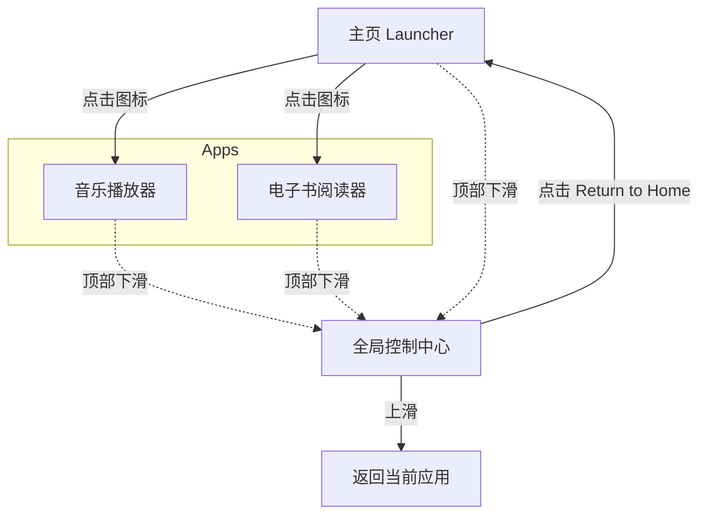

# 交互设计方案 V2：沉浸式多媒体系统

## 1. 设计理念
摒弃单纯的"页面跳转"逻辑，引入**系统层 (System Layer)** 和 **应用层 (App Layer)** 的概念。
*   **应用层**：专注于内容展示（阅读、播放、浏览），尽可能全屏沉浸。
*   **系统层**：提供全局控制能力，随时随地可以呼出，打断但不退出当前应用。

## 2. 核心交互架构

### 2.1 全局控制中心 (Global Control Center)
这是本方案的核心。无论用户当前在主页、看小说还是看图片，从屏幕**顶部边缘下滑**呼出一个全屏的覆盖层。

*   **功能布局**：
    *   **左上角 - 时间信息**：
        *   **时间**：48px 大字体显示当前时间
        *   **日期**：小字体显示日期
    *   **右下角 - 系统控制**：
        *   **Return to Home 按钮**：圆角按钮，一键返回主界面
    *   **底部中间 - 上滑提示**：
        *   显示 ↑ 箭头，提示用户可以上滑关闭

*   **关闭方式**：
    *   上滑手势关闭
    *   点击 Return to Home 按钮（关闭并返回主页）

### 2.2 手势触发区
*   **位置**：屏幕顶部 15px 高的透明区域
*   **实现**：使用 `lv_layer_top()` 创建，始终在最上层
*   **触发条件**：从触发区向下滑动超过 50px

### 2.3 应用内交互规范

#### A. 电子书 (Book) - 沉浸阅读模式
*   **默认状态**：全屏显示文字，无任何按钮干扰。
*   **交互操作**：
    *   **点击屏幕左/右侧**：翻页
    *   **点击屏幕中央**：呼出返回按钮
    *   **顶部下滑**：呼出控制中心

#### B. 音乐播放器 (Audio) - 专注模式
*   **默认状态**：全屏显示专辑封面、歌词、频谱。
*   **交互操作**：
    *   **顶部下滑**：呼出控制中心

## 3. 技术实现

### 3.1 模块结构
*   **`system_bar.c/h`**：控制中心模块
    *   `system_bar_init()` - 初始化控制中心
    *   `system_bar_show()` - 显示控制中心
    *   `system_bar_hide()` - 隐藏控制中心
    *   `system_bar_update_time()` - 更新时间显示
    *   `system_bar_is_visible()` - 检查是否可见

### 3.2 LVGL 层级
*   控制中心使用 `lv_layer_top()` 创建，确保始终在所有视图之上
*   手势触发区单独创建，使用 `lv_obj_move_foreground()` 保持最前

### 3.3 UI 规格
*   **背景色**：RGB(20, 25, 35)，不透明
*   **时间字体**：48px
*   **日期字体**：20px，灰色 (#888888)
*   **Return to Home 按钮**：180x50px，圆角 25px，深灰色背景

## 4. 页面流转图 (User Flow)

## 5. 已实现功能

- [x] 全屏控制中心 UI
- [x] 时间和日期显示
- [x] Return to Home 按钮
- [x] 全局手势触发区（15px 顶部边缘）
- [x] 上滑关闭手势
- [ ] 定时器每分钟刷新时钟
